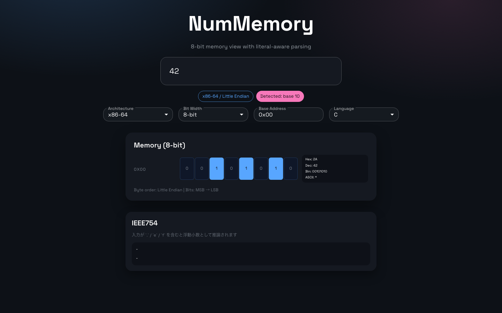

# NumMem

数値リテラルを入力すると、メモリ上のビット配置と各種変換を表示するシングルページWebアプリです。



## Features
- 数値入力に応じたメモリビット表示（8/16/32/64/128bit）
- 言語ごとのリテラル推論（C / Python / JavaScript）
- 8bitごとの変換表示（Hex/Dec/Bin/ASCII）
- アーキテクチャのエンディアン切り替え
- IEEE754 (float32/float64) のビット表示と仮数の10進小数換算
- ベースアドレスの指定

## Quick Start
```bash
yarn
yarn dev
```

## Build
```bash
yarn build
```

## Screenshot
ローカルで `yarn dev` を起動した状態で実行します。

```bash
yarn screenshot
```

必要ならURLや出力先を指定できます。
```bash
SHOT_URL=http://localhost:5173/ SHOT_OUT=docs/screenshot.png yarn screenshot
```

## GitHub Pages
`docs/` をデプロイ対象にしています（Deploy from a branch）。

- Branch: `gh-pages`
- Folder: `/docs`

`vite.config.ts` の `base` は `/NumMem/` に設定済みです。

## Input Examples
- `255`
- `0xff`
- `0b101010`
- `3.14`
- `1.0f`
